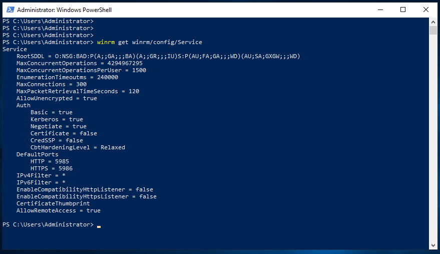

# WinRM basic setup for LAN operations

Windows Server 2019 comes with WinRM installed with the following defaults

`winrm get winrm/config/Service`

To simplify ansible access to WinRM SOAP WS we can lower the security

`Set-Item -Path WSMan:\localhost\Service\Auth\Basic -Value Strict true`

`Set-Item -Path WSMan:\localhost\Service\AllowUnencrypted -Value Strict true`

## Ansible on Windows

### Ping

`ansible $ANSIBLE_HOST_PATTERN -vvvv -e 'ansible_password='"$ANSIBLE_PASSWORD"'' -e 'ansible_port=5985' -e 'ansible_winrm_scheme=http' -m win_ping`

### Playbook

`ansible-playbook --limit $ANSIBLE_HOST_PATTERN -e 'ansible_password='"$ANSIBLE_PASSWORD"'' -e 'ansible_port=5985' -e 'ansible_winrm_scheme=http' pb00_choco.yml`
